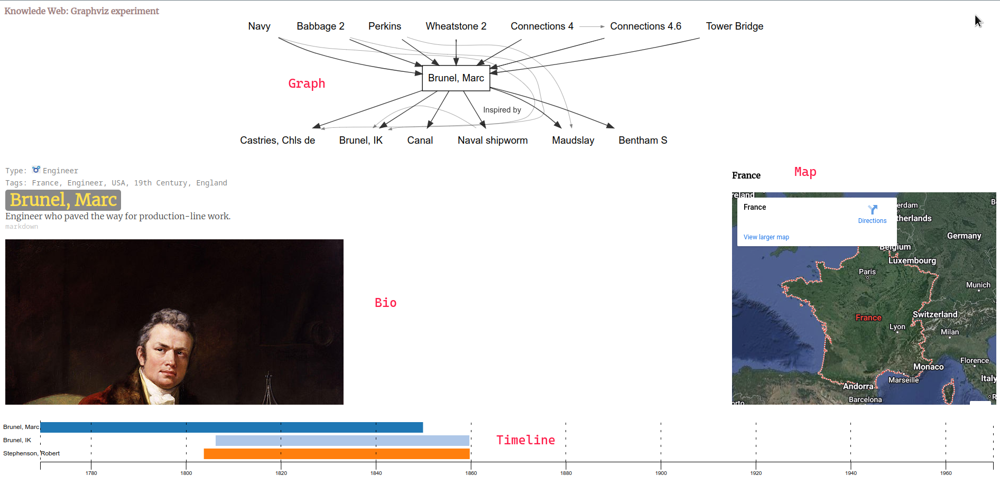
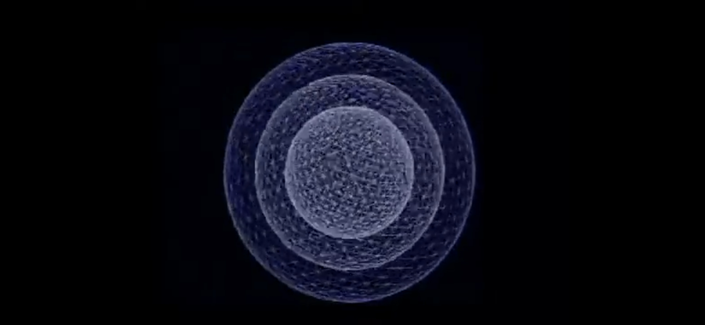
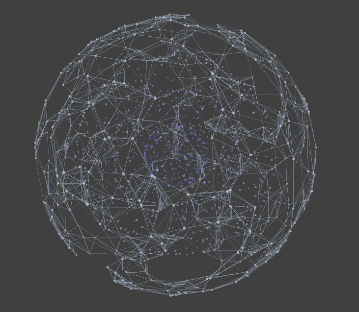
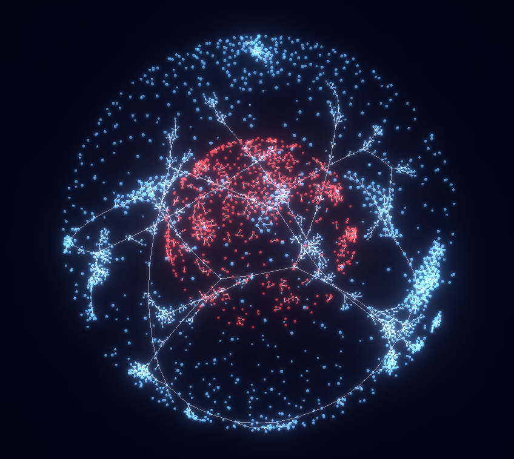

# Welcome to the K-Web 👋

The Knowledge Web provides an opportunity for users of all kinds and ages and interests to learn about how interactivity works. It offers the chance to experience history the way the players at the time did: full of surprise twists and turns, accidents, discoveries, friends and foes. Above all, the K-Web reveals how they never knew what was coming next. Just like you.

 – James Burke 

**Next, what we are building:**

<!--

**Here are some ideas to get you started:**

🙋‍♀️ A short introduction - what is your organization all about?
🌈 Contribution guidelines - how can the community get involved?
👩‍💻 Useful resources - where can the community find your docs? Is there anything else the community should know?
🍿 Fun facts - what does your team eat for breakfast?
🧙 Remember, you can do mighty things with the power of [Markdown](https://docs.github.com/github/writing-on-github/getting-started-with-writing-and-formatting-on-github/basic-writing-and-formatting-syntax)
-->

# K-Web User Interface — Minimal Product

  
🧐 The Knowledge Web?

  Find an explanation [here](https://webbrain.com/brainpage/brain/C6015FA0-82BF-F1FA-9D05-0EA9FD7F845E#-2751) (in the old Knowledge Web [Brain](https://www.thebrain.com/)).

  - More, not mentioned there…
    - The K-Web should help you see how you connect to everything (and how everyone is significant).
    - The K-Web should make you realize that you are in a box (which one & its limitations).
        
        💬 Not to forget: Even thought James Burke’s thinking has changed the universe, or at least changed how people perceive history, change & themselves in relation to it, James Burke’s Knowledge Web will always be biased & limited (it exists in the “Burke Box”).
        
  - Thoughts on the passage of time…
    
    Note that the core vision is about ¼ century old, yet not fully explored elsewhere, as far as I know… Let's start with the original vision and build on it!

 

> ❓ **How would a minimal Knowledge Web user interface look?** Useful enough to replace The Brain as default interface.
> 

Help me figure this out! Here follows a first draft.

💬 Please comment (right in this document or 📨 [karl@passionismandatory.com](mailto:karl@passionismandatory.com)) something is unclear, missing, wrong, could be improved …or for any other reason!

<h2>💻 Interface elements</h2>

From the recent experiment “graphviz1”, has all core elements.

From the recent experiment “sketch”, perhaps more of the look we want but it lacks one element: the timeline.

).](img/Untitled%202.png)

A prototype from the early 2000s (shown in [this video](https://youtu.be/_gtQ5LDx_H0)).

Interaction with any of the elements is reflected in the others (instantly / on hover).

### **💎 Minor elements**

- 🔍 Search nodes (by name)
- 🔗 Back / forward buttons work & URL shareable (node ref. in URL, ex `?node=...`)

<h2>🕸️ Graph (plex or connectome)</h2>

- 1. Chosen node & neighbors (names) + links.
    
    .](img/Untitled%203.png)
    
    From [The Brain](https://webbrain.com/brainpage/brain/C6015FA0-82BF-F1FA-9D05-0EA9FD7F845E#-2209).
    
    - Another example
        
        
        
        From one of the recent experiments.
        
- 2. Link descriptions (always or when hovered / neighbor hovered).
    
    
    
    From The Brain.
    
    
    
    From the experiment “graphviz1”.
    
- 3. Click node to travel.
    
    Graph, timeline, map & bio is updated.
    
- 4. Hover node to preview bio, timeline & map
    
    Just like Click / Travel above, but a preview (move your cursor and you are back).
    
- 5. Extra: See 2nd neighbors [on hover]…

<h2>⏳ Timeline</h2>

 — not perfect but might be a start?](img/Untitled%207.png)

From [https://observablehq.com/@liuyao12/timeline](https://observablehq.com/@liuyao12/timeline) — not perfect but might be a start?

**Default mode:**

1. Show lifespan of current node (highlighted / at the top).
2. Show neighboring nodes.
3. Hover / Click; preview, just like hovering / clicking neighbors in the *Graph*.

**Extra:** Possible to zoom and pan.

<h2>🌏 Map (globe)</h2>

Generally a dim globe in the top left corner, unless interacted with (click to “activate” & enlarge).

Activated globe in “sketch” experiment using CesiumJS.

(Eurocentric) Google Earth example.

1. Prominent pin & center on location (or birth place) of current node.
2. Small dots (or pins) on the neighboring nodes' locations.
3. Click / Hover dots / pin; go to / preview, same as *Graph* (& *Timeline*).

<h2>🖼️ Bio (hyperlinked text + media)</h2>

Biography / information with text, images, links (to other nodes), etc …much like The Brain.

- Click / Hover (internal) link; preview, same as *Graph*(, *Timeline* & *Map*).
    
    
    
    From The Brain.
    

<h2>👣 Trails (”bread crumbs”) & Journeys / Mystery Tours</h2>

**Trail / breadcrumb:** Show the last 6-10 visited nodes and their relationships.

**Journeys / Mystery Tours:** Stored Trails that can be followed along.

Textual representation.

Graph representation example (from experiment “3d-graph-present”).

PS. The Brain seems to have a sort of bread crumb only on desktop (not available to the public).

<h2>🌐 Spheres (time construct)</h2>

<aside>
📢 **Please help us with this!** Ask [Karl](https://www.notion.so/Animal-cell-earth-scale-comparison-98d25ab2c3764b74808d7cdf67dcf139?pvs=21) for sample data & details 🙃

</aside>

Century spheres (+ outer “Gateway layer”): a potentially delightful (optional) way to explore & enter into the Web. Perhaps described best by Burke in this [old video](https://youtu.be/Ei8aATwB5Q4).

From the video.

Some experiments:

Incomplete & “fake” but might get the idea across…

Slightly less “fake” (actually a force directed graph) but still not real (a few more connections and it collapses).

**All three examples lack:**

- Display current century ex “19th century” or “1800s” (or “modern world” / “gateways”).
- Links between centuries (not crucial).

<h2>🔭 Next (beyond minimal)</h2>

## 🌌 Extended exploration from timeline & map

Explore from timeline, map & a combination: *“What else was going on there at that time?”* ...not only from the graph.

## 🤖 Avatar assistant (James Burke ~AI)

> ***HELP AVATAR (CAN BE TURNED OFF)***
> 
> 
> *Needs to be able to answer queries in voice and/or writing. Unprompted, it should be able to remind, praise, teach, suggest, auto-explain; etc.
> [Design of avatar in keeping with overall design, perhaps something like a semi-translucent hologram head and shoulders of Burke]*
> 

From a (2004?) design document.

<h2>Appendix</h2>

## 💽 The database(s)

- **The Brain**
    - The official Knowledge Web lives in The Brain (Team license required to edit).
    - Auto exporting the data is easy.
    - Reading is too.
- **Old XML**
    - ~2 000 old xml-files (~12 000 links); has link description lacking in The Brain…
- **Wikipedia** / data
    - Plan: Wikipedia links → all nodes in The Brain; supplement & augment with WikiData.

## 🤲 Contribute

- Checkout [GitHub](https://github.com/knowledge-web/kweb-ui).
- Contact 💌 [karl@passionismandatory.com](mailto:karl@passionismandatory.com) (Karl Svartholm) & join Discord.
- Coding not your thing? Apply to be a content curator: 💌 [patmck13@gmail.com](https://www.notion.so/2021-09-13-Trying-something-d45a7629595f45c6b26400d1d9f06ebc?pvs=21) (Patrick McKercher).